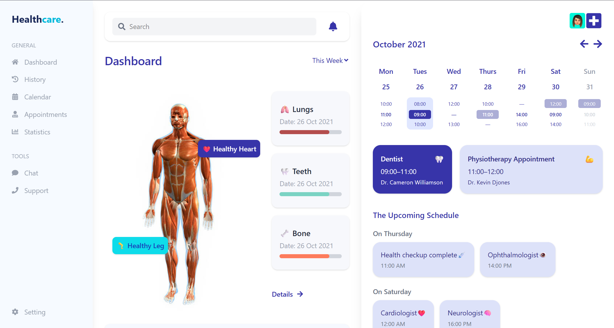

## 👉 [Live Demo](https://your-deployment-link.vercel.app)

---

# 🩺 Health Dashboard UI

A sleek and responsive health dashboard built using **React** and **Tailwind CSS**. This project presents a user-friendly interface to visualize daily appointments, weekly calendar events, upcoming schedules, and a basic human anatomy view.

## ✨ Features

- 📅 **Calendar View:** Visualize weekly appointments with time slots.
- 🦷 **Upcoming Schedule Section:** List of appointments grouped by day.
- 🧍 **Anatomy Overview:** Human body image with healthy organ labels.
- 📊 **Health Stats:** Progress bars showing organ check-up status.
- 🌗 **Dark-Light Ready:** Clean modern design ready for theme switch (can be extended).

---

## 📸 Screenshots

  
_Image: Sample UI view of the health dashboard_

---

## 🛠️ Tech Stack

- **Frontend:** React.js
- **Styling:** Tailwind CSS
- **Icons:** React Icons

---

## 🚀 Getting Started

### Prerequisites

- Node.js v14+
- npm or yarn

### Installation

```bash
git clone https://github.com/yourusername/health-dashboard.git
cd health-dashboard
npm install
```

### 💡 Author

- Yatharth
- 🔗 [Linkedin](https://www.linkedin.com/in/yatharth-raj-giri-b51579287/) • [Twitter](https://x.com/YatharthGiri108) • [Email](mailto:yatharthgiri187@gmail.com) • [Portfolio](https://portfolio-five-olive-73.vercel.app/)
- 📫 Reach out for collaborations or feedback!
